# 🤖 AI Autonomous DevOps Healer

> An AI-powered autonomous agent that monitors AWS EKS clusters, detects failures, analyzes root cause using LLM, and self-heals without human intervention.


---

## 🏗️ Architecture

```
Pod Crash (EKS)
      ↓
Prometheus → Alertmanager
      ↓
Webhook → FastAPI Server
      ↓
LangChain Agent (Groq/Bedrock)
      ↓
┌─────────────────────────┐
│  Tools:                 │
│  → K8s Log Fetcher      │
│  → Prometheus Metrics   │
│  → Log Analyzer         │
│  → Slack Notifier       │
└─────────────────────────┘
      ↓
Self-Heal (Pod Restart/Rollback)
      ↓
Slack Report → #alerts
```

---

## 🛠️ Tech Stack

| Category | Tool |
|---|---|
| **AI Agent** | LangChain + LangGraph |
| **LLM (Dev)** | Groq (Llama 3.3 70B) |
| **LLM (Prod)** | AWS Bedrock (Claude Haiku) |
| **API Server** | FastAPI + Uvicorn |
| **Infrastructure** | Terraform (Modules) |
| **Cloud** | AWS Mumbai (ap-south-1) |
| **Container** | Docker |
| **Orchestration** | AWS EKS (Kubernetes) |
| **Monitoring** | Prometheus + Grafana |
| **Alerting** | Alertmanager |
| **Notification** | Slack |
| **CI/CD** | GitHub Actions |
| **App** | StudentSphere (React + Spring Boot + MariaDB) |

---

## 🔐 Security Architecture

```
PUBLIC SUBNET:
→ Load Balancer (Internet facing)
→ React Frontend
→ NAT Gateway

PRIVATE SUBNET:
→ EKS Worker Nodes
→ Spring Boot Backend  ← No direct internet
→ MariaDB Database     ← No direct internet
→ AI Agent             ← No direct internet
→ Prometheus/Grafana   ← No direct internet
```

---

## 📁 Project Structure

```
ai-autonomous-devops-healer/
├── agent/                    # AI Agent
│   ├── main.py               # FastAPI server
│   ├── agent_core.py         # LangChain agent
│   └── tools/
│       ├── k8s_healer.py     # K8s actions
│       ├── log_analyzer.py   # Log analysis
│       ├── prometheus_fetcher.py
│       └── slack_notifier.py
├── app/
│   ├── frontend/             # React app
│   └── backend/              # Spring Boot
├── terraform/                # IaC
│   └── modules/
│       ├── vpc/
│       ├── eks/
│       ├── ec2/
│       └── security_groups/
├── k8s/                      # K8s manifests
│   ├── app/
│   └── agent/
├── monitoring/               # Prometheus config
├── .github/workflows/        # GitHub Actions
└── docs/screenshots/         # Proof of work
```

---

## 🚀 Phases Completed

### Phase 1 — Project Setup
**What:** GitHub repo created with fresh folder structure and StudentSphere app code copied.

**Why:** Clean codebase ensures no legacy issues from previous projects.

**How:** Cloned repo, copied only frontend/backend code, created fresh structure.

---

### Phase 2 — AWS Infrastructure (Terraform)
**What:** Production-grade AWS infrastructure using Terraform modules.

**Why:** Infrastructure as Code ensures reproducibility and version control.

**How:** Custom VPC with public/private subnets, IGW, NAT Gateway, Security Groups, EKS cluster — all via Terraform modules.

```bash
cd terraform
terraform init
terraform plan
terraform apply
```

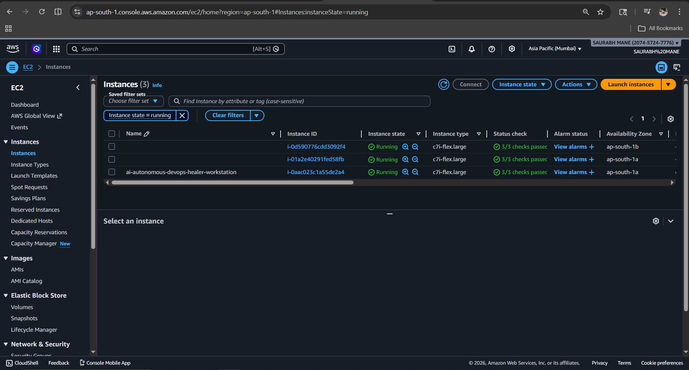
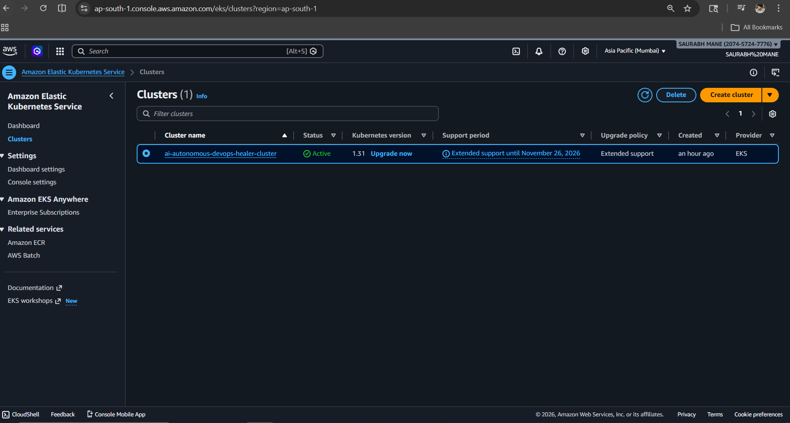
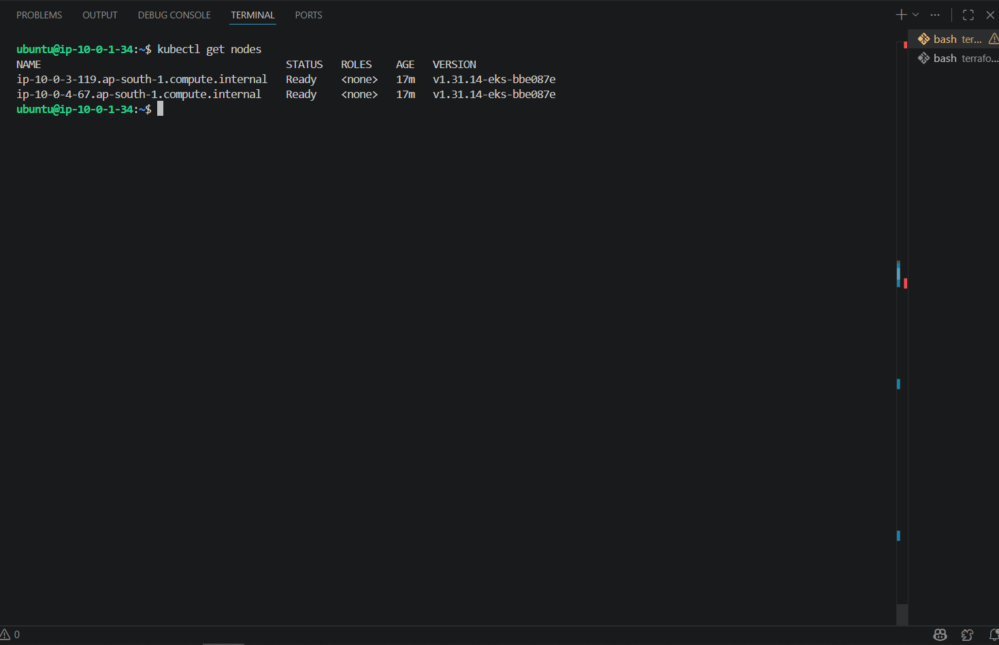

---

### Phase 3 — App Deployment on EKS
**What:** StudentSphere (React + Spring Boot + MariaDB) deployed on EKS.

**Why:** Need a real application to monitor and heal.

**How:** Fresh Dockerfiles (multi-stage), K8s manifests with services, LoadBalancer for frontend.

```bash
kubectl apply -f k8s/app/mariadb.yaml
kubectl apply -f k8s/app/backend.yaml
kubectl apply -f k8s/app/frontend.yaml
```

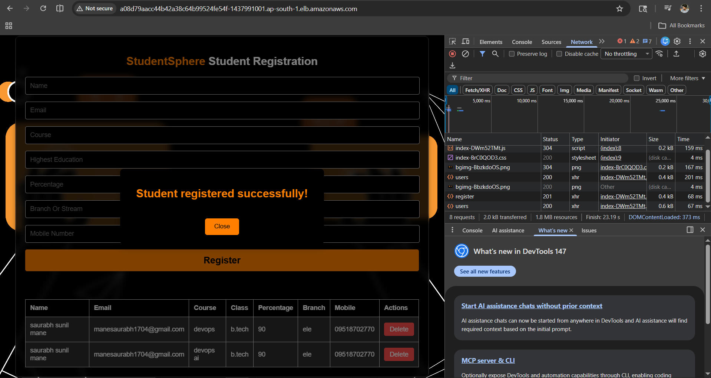

---

### Phase 4 — Monitoring Stack
**What:** Prometheus + Grafana + Alertmanager installed via Helm.

**Why:** Need metrics collection and alerting to detect failures.

**How:** kube-prometheus-stack Helm chart with custom alert rules for pod crashes, high CPU, memory issues.

```bash
helm install prometheus prometheus-community/kube-prometheus-stack \
  --namespace monitoring
kubectl apply -f monitoring/alert-rules.yaml
```

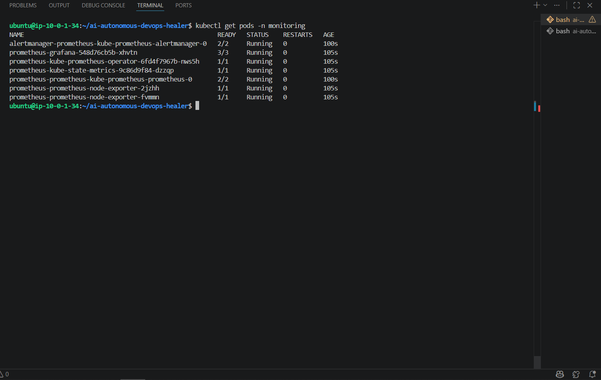

---

### Phase 5 — AI Agent Build
**What:** LangChain agent with Groq LLM, FastAPI webhook server.

**Why:** Autonomous analysis and healing without human intervention.

**How:** LangChain tools for K8s, Prometheus, log analysis. FastAPI for webhook endpoint.

```bash
uvicorn agent.main:app --host 0.0.0.0 --port 8000
```

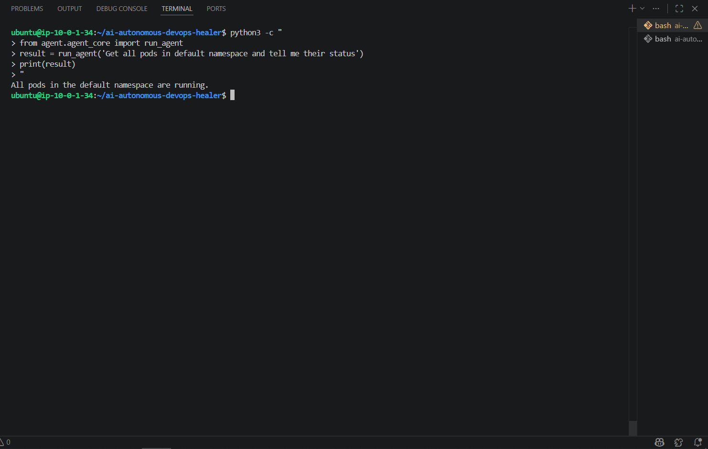
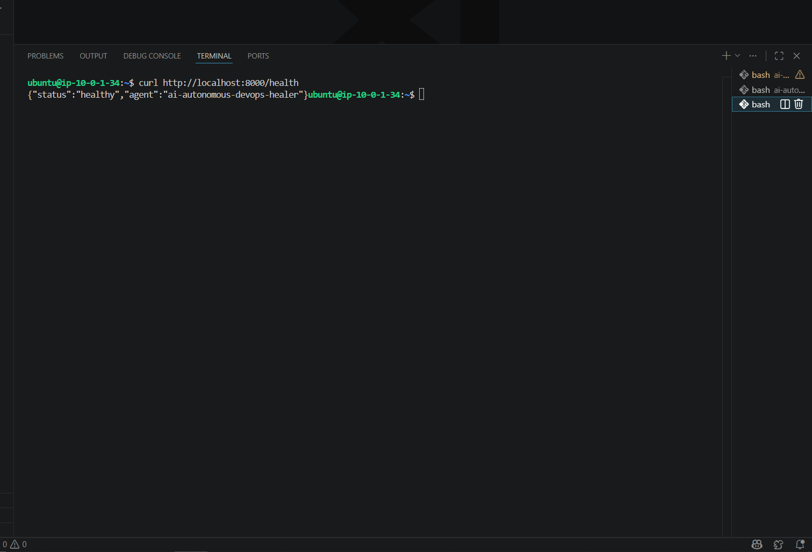
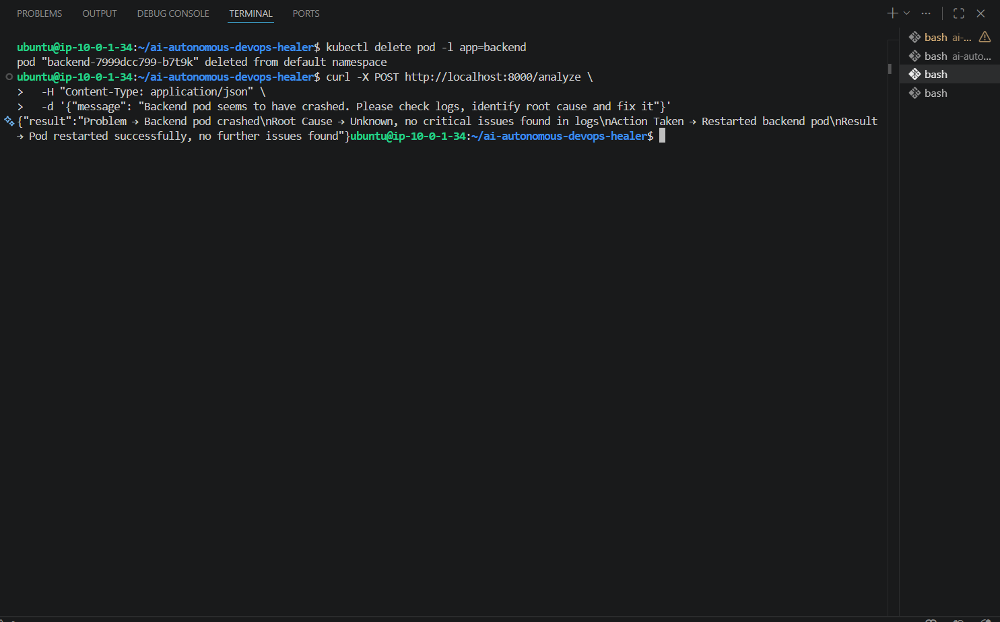

---

### Phase 6 — GitHub Actions CI/CD
**What:** Automated pipeline — build, push, deploy on every code push.

**Why:** Continuous delivery ensures latest code always deployed.

**How:** GitHub Actions with DockerHub and AWS EKS integration.

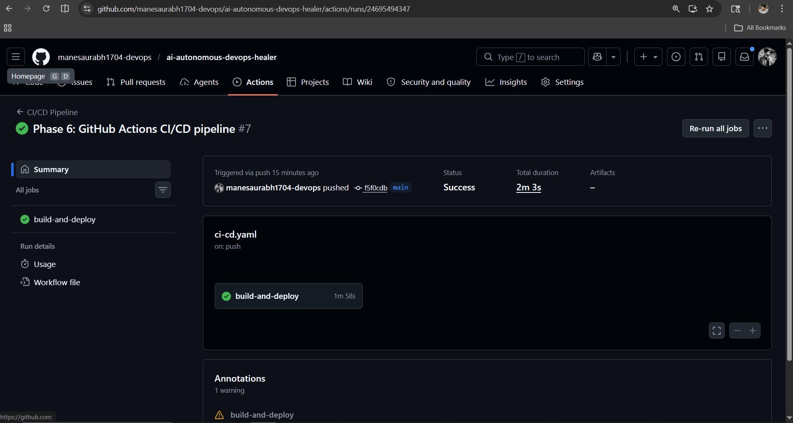
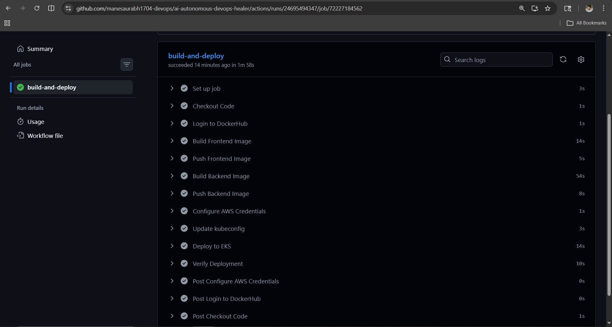

---

### Phase 7 — Slack Notifications
**What:** AI agent sends real-time alerts to Slack #alerts channel.

**Why:** Team visibility on cluster health and healing actions.

**How:** Slack Incoming Webhooks + LangChain tool for notifications.

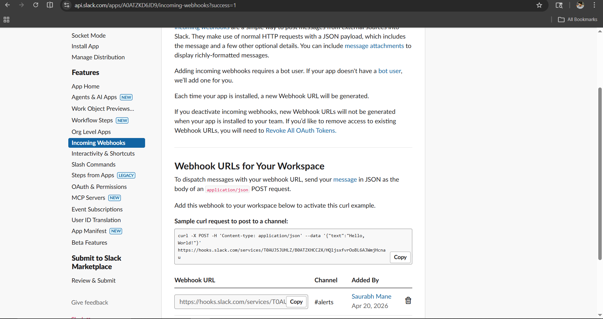
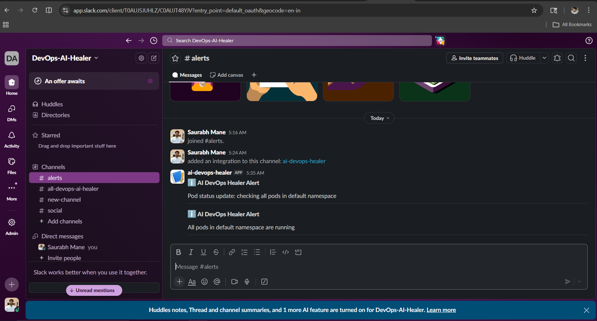

---

### Phase 8 — Agent on Kubernetes
**What:** AI agent deployed as a pod on EKS with RBAC.

**Why:** Production deployment — agent runs inside the cluster it monitors.

**How:** ServiceAccount + ClusterRole + Deployment with K8s secrets.

```bash
kubectl apply -f k8s/agent/deployment.yaml
```

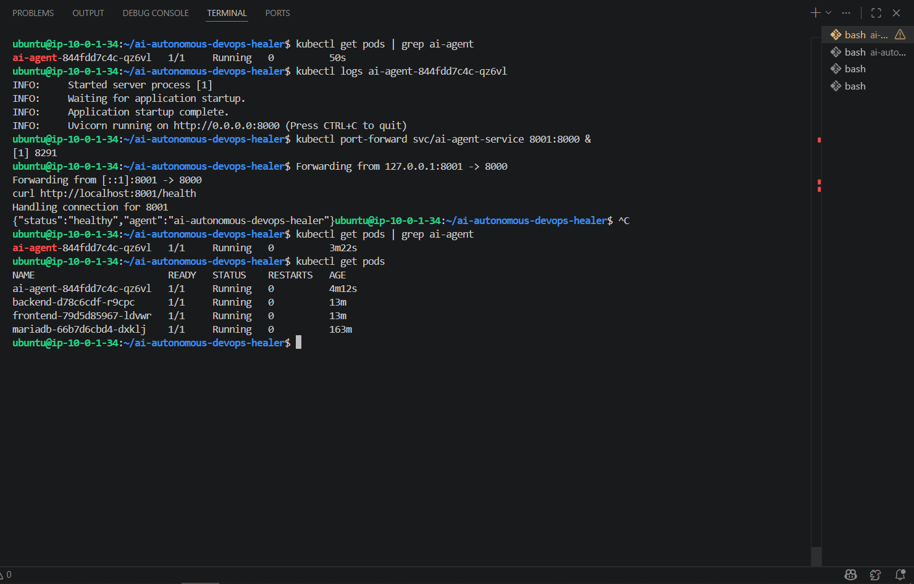

---

### Phase 9 — AWS Bedrock Integration
**What:** AWS Bedrock (Claude Haiku) integrated as production LLM.

**Why:** Native AWS integration with IAM authentication — no API keys.

**How:** `USE_BEDROCK=true` env flag switches from Groq to Bedrock seamlessly.

```python
# Development
llm = ChatGroq(model="llama-3.3-70b-versatile")

# Production (one flag change)
llm = ChatBedrock(model_id="anthropic.claude-3-haiku-20240307-v1:0")
```

---

### Phase 10 — Grafana Dashboard
**What:** Kubernetes monitoring dashboard with pod metrics.

**Why:** Visual monitoring of cluster health and resource usage.

**How:** Grafana dashboard ID 15760 imported with Prometheus datasource.

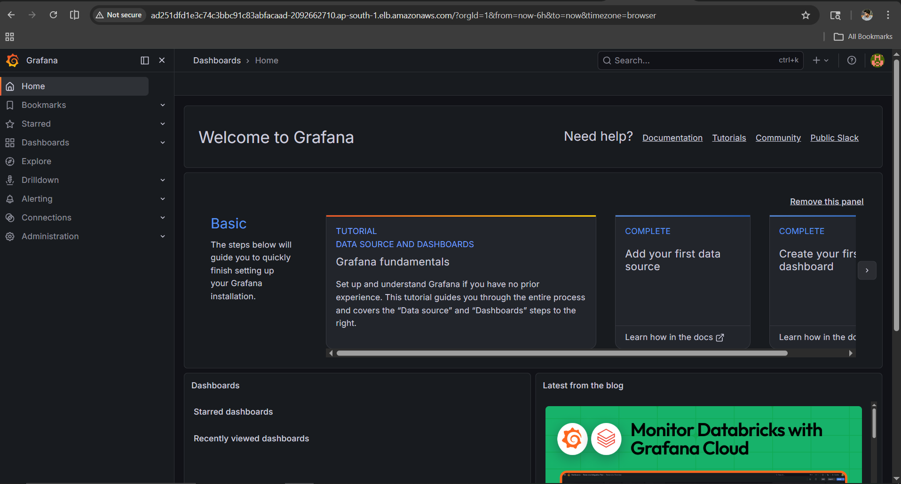
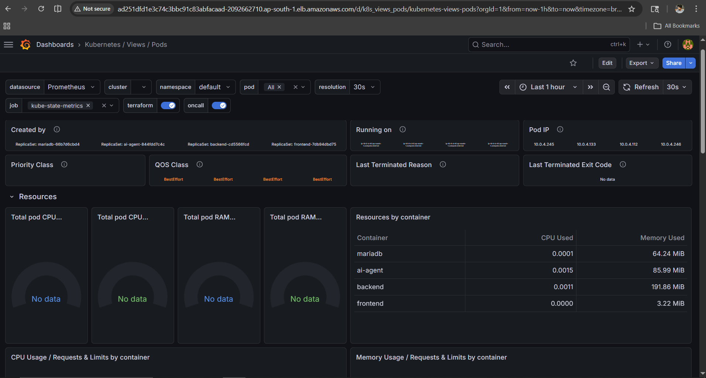

---

### Phase 11 — Chaos Engineering Demo
**What:** End-to-end self-healing demonstration.

**Why:** Prove the system works under real failure conditions.

**How:** Deliberately crashed backend pod, agent detected, analyzed, restarted, and notified Slack.

**Demo Flow:**
```
kubectl delete pod -l app=backend    # Crash!
     ↓
Agent detects failure
     ↓
Analyzes logs + root cause
     ↓
Restarts pod automatically
     ↓
Slack: "Pod restarted successfully!"
```

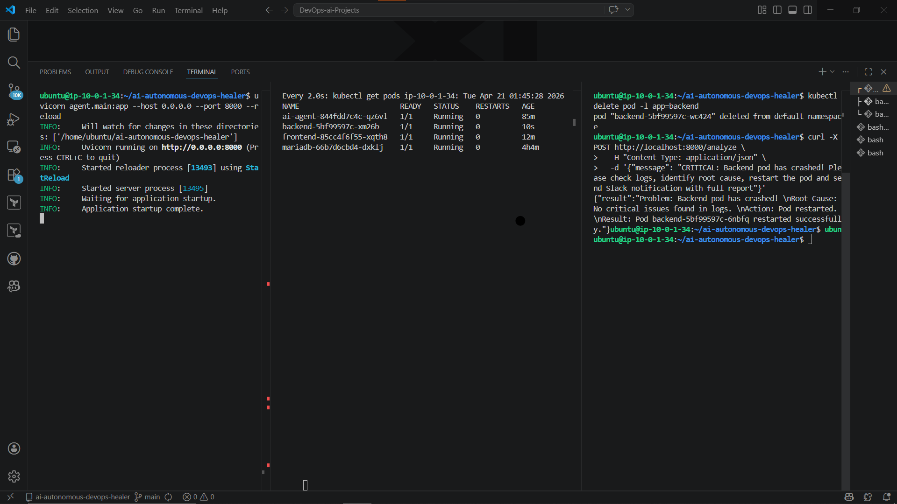
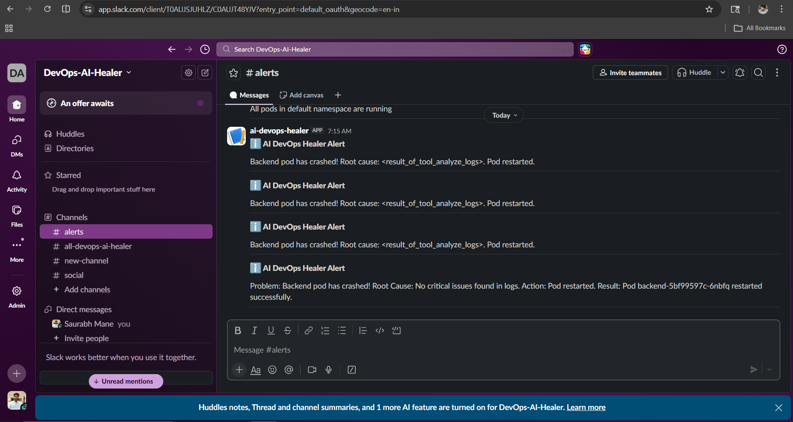

---

## 🎯 Key Features

```
✅ Autonomous pod failure detection
✅ AI-powered root cause analysis
✅ Automatic self-healing (restart/rollback)
✅ Real-time Slack notifications
✅ Production-grade AWS infrastructure
✅ GitOps with GitHub Actions CI/CD
✅ Grafana monitoring dashboards
✅ AWS Bedrock + Groq dual LLM support
✅ Kubernetes RBAC security
✅ Private subnet isolation for backend/DB
```

---

## 🔧 Local Setup

### Prerequisites
```
- Python 3.10+
- Docker
- kubectl
- AWS CLI configured
- Groq API key (free at console.groq.com)
```

### Setup
```bash
git clone https://github.com/manesaurabh1704-devops/ai-autonomous-devops-healer.git
cd ai-autonomous-devops-healer

pip install -r requirements.txt
cp .env.example .env
# Add GROQ_API_KEY in .env

uvicorn agent.main:app --host 0.0.0.0 --port 8000
```

### Test Agent
```bash
curl -X POST http://localhost:8000/analyze \
  -H "Content-Type: application/json" \
  -d '{"message": "Check all pods and report status"}'
```

---

## 👨‍💻 Author

**Saurabh Mane** — DevOps Engineer
- GitHub: [@manesaurabh1704-devops](https://github.com/manesaurabh1704-devops)
- DockerHub: [manesaurabh1704devops](https://hub.docker.com/u/manesaurabh1704devops)
