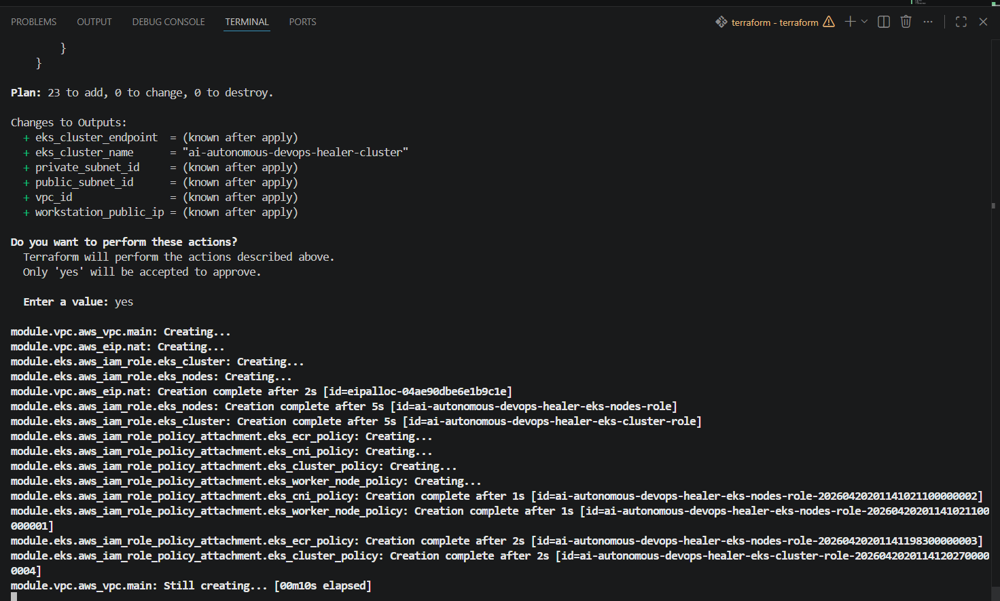
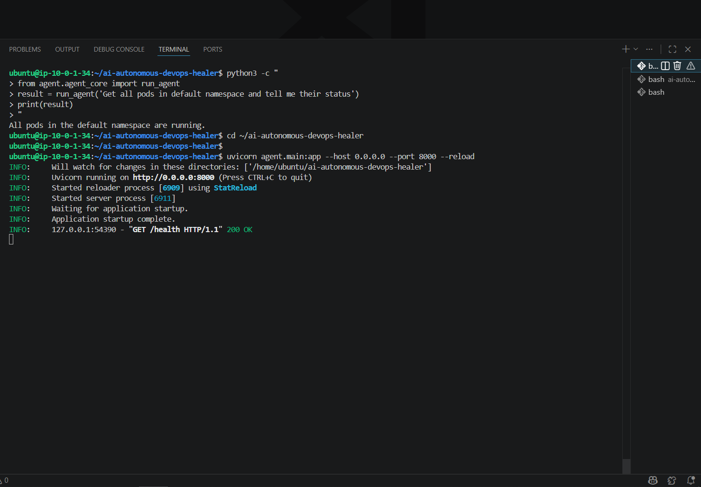
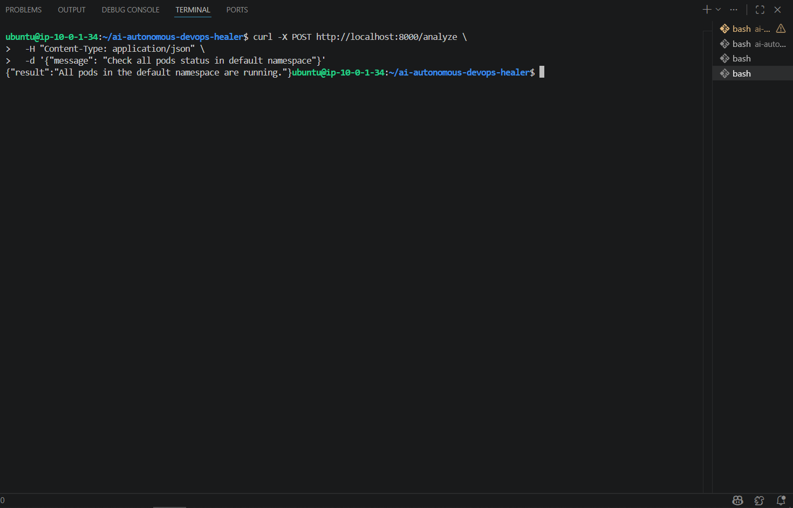
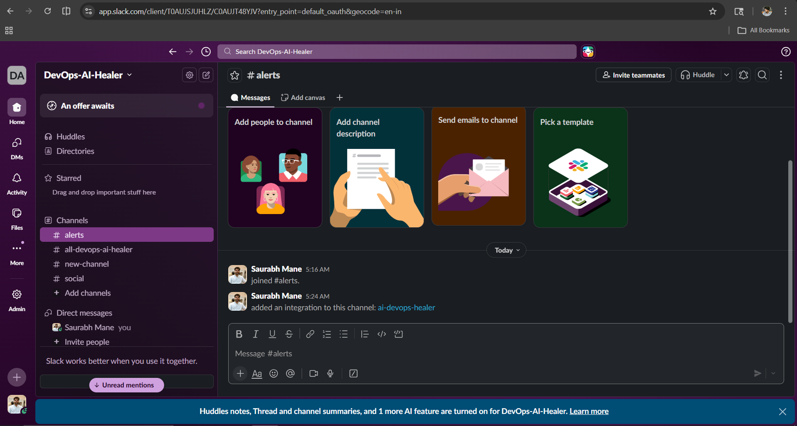
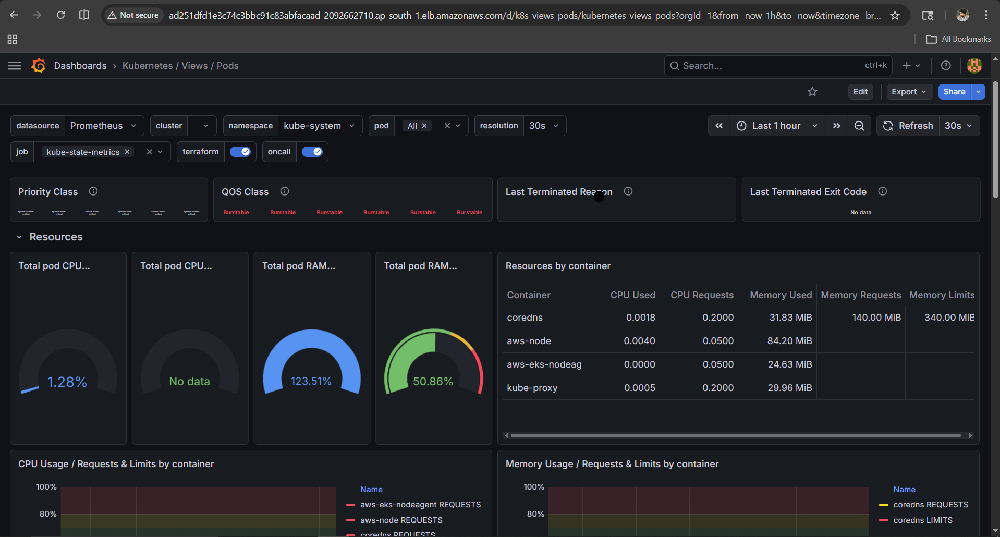
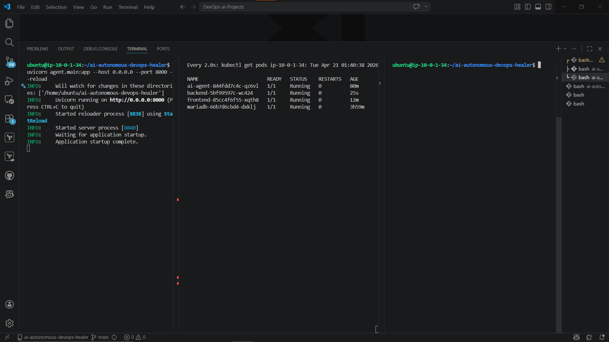
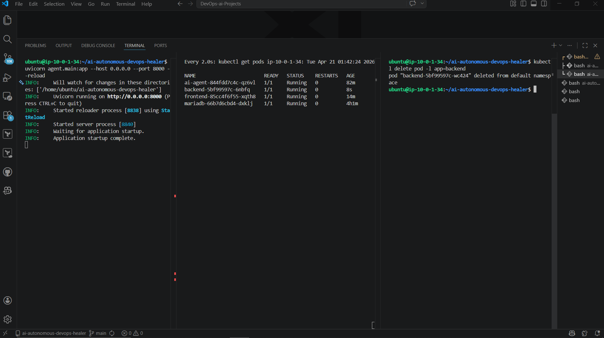

# 🤖 ai-autonomous-devops-healer

<div align="center">

**An AI-powered autonomous agent that watches your Kubernetes cluster 24/7, detects pod failures, analyzes root cause using LLM, and self-heals — without any human intervention.**


</div>

---

## 📌 What Is This?

A production-grade **Agentic AI DevOps system** built on AWS EKS. When a pod crashes:

1. **Prometheus** detects the failure
2. **Alertmanager** fires a webhook
3. **FastAPI** receives the alert
4. **LangChain Agent** (powered by Groq/AWS Bedrock) analyzes logs and identifies root cause
5. **Agent self-heals** — restarts the pod or rolls back the deployment
6. **Slack** gets a full incident report

No pager alerts. No manual `kubectl` commands. Just autonomous healing.

---

## 🏗️ Architecture

### Infrastructure Layout

```
YOUR LAPTOP (VS Code)
        │
        │ SSH Connection
        ▼
┌─────────────────────────────────────────────────────────┐
│                  AWS Mumbai (ap-south-1)                 │
│                  Custom VPC (10.0.0.0/16)                │
│                                                          │
│  ┌───────────────────────────────────────────────────┐   │
│  │              PUBLIC SUBNET (10.0.1.0/24)          │   │
│  │                                                   │   │
│  │   🌐 Internet Gateway                             │   │
│  │   ⚖️  Load Balancer  ←── Users enter here        │   │
│  │   🖥️  React Frontend                              │   │
│  │   🔀 NAT Gateway (outbound only)                  │   │
│  └───────────────────────────────────────────────────┘   │
│                        │                                 │
│              Internal traffic only                       │
│                        ↓                                 │
│  ┌───────────────────────────────────────────────────┐   │
│  │              PRIVATE SUBNET (10.0.2.0/24)         │   │
│  │                                                   │   │
│  │   ☸️  EKS Cluster (c7i-flex.large nodes)          │   │
│  │        ├── Spring Boot Backend  ❌ No internet    │   │
│  │        ├── MariaDB Database     ❌ No internet    │   │
│  │        ├── AI Agent (FastAPI)   ❌ No internet    │   │
│  │        ├── Prometheus           ❌ No internet    │   │
│  │        ├── Grafana              ❌ No internet    │   │
│  │        └── Alertmanager         ❌ No internet    │   │
│  └───────────────────────────────────────────────────┘   │
└─────────────────────────────────────────────────────────┘
```

### Self-Healing Flow

```
                    Pod Crashes
                         │
                         ▼
              ┌─────────────────────┐
              │      Prometheus     │  detects restart rate spike
              └─────────────────────┘
                         │
                         ▼
              ┌─────────────────────┐
              │    Alertmanager     │  routes alert to webhook
              └─────────────────────┘
                         │
                         ▼
              ┌─────────────────────┐
              │    FastAPI Server   │  /webhook endpoint receives alert
              └─────────────────────┘
                         │
                         ▼
              ┌─────────────────────┐
              │   LangChain Agent   │  decides which tools to call
              └─────────────────────┘
               │        │        │
        ┌──────┘        │        └──────┐
        ▼               ▼               ▼
  get_pod_logs()  analyze_logs()  get_metrics()
        └──────┐        │        ┌──────┘
               ▼        ▼        ▼
              ┌─────────────────────┐
              │  Groq / Bedrock LLM │  root cause analysis
              └─────────────────────┘
                         │
                         ▼
              ┌─────────────────────┐
              │   restart_pod() or  │  self-heal action
              │   rollback()        │
              └─────────────────────┘
                         │
                         ▼
              ┌─────────────────────┐
              │    Slack #alerts    │  full incident report sent
              └─────────────────────┘
```

### Terraform Module Structure

```
terraform/
├── main.tf                 ← Only module calls (clean, readable root)
├── variables.tf
├── outputs.tf
└── modules/
    ├── vpc/                ← VPC + Subnets + IGW + NAT Gateway
    ├── security_groups/    ← LB SG, Frontend SG, Backend SG, DB SG
    ├── ec2/                ← Workstation EC2 instance
    └── eks/                ← EKS Cluster + Node Group + IAM Roles
```

---

## 🛠️ Tech Stack

| Category | Tool | Purpose |
|---|---|---|
| **AI Agent** | LangChain + LangGraph | Agent orchestration + tool calling |
| **LLM (Dev)** | Groq — Llama 3.3 70B | Free, fast development LLM |
| **LLM (Prod)** | AWS Bedrock — Claude Haiku | Production, IAM auth, no API keys |
| **API Server** | FastAPI + Uvicorn | Webhook receiver + REST API |
| **IaC** | Terraform Modules | Reproducible infrastructure as code |
| **Cloud** | AWS ap-south-1 (Mumbai) | Cloud provider |
| **Container** | Docker (multi-stage builds) | Optimized image builds |
| **Orchestration** | AWS EKS — Kubernetes 1.31 | Managed container orchestration |
| **Monitoring** | Prometheus + Grafana | Metrics collection + dashboards |
| **Alerting** | Alertmanager | Alert routing to agent webhook |
| **Notification** | Slack Incoming Webhooks | Incident reporting |
| **CI/CD** | GitHub Actions | Build → Push → Deploy automation |
| **App** | StudentSphere (React + Spring Boot + MariaDB) | Target application being monitored |

---

## 🔐 Security Design

```
LAYER 1 — VPC Isolation
  Private subnet has no direct route to internet
  Only NAT Gateway for outbound traffic (not inbound)

LAYER 2 — Security Groups (least privilege)
  Load Balancer SG  → Allow 80/443 from internet only
  Frontend SG       → Allow traffic from LB SG only
  Backend SG        → Allow traffic from Frontend SG only
  Database SG       → Allow traffic from Backend SG only
  EKS Nodes SG      → Allow intra-cluster traffic only

LAYER 3 — Kubernetes RBAC
  AI Agent uses ServiceAccount with ClusterRole
  Only permissions needed — no cluster-admin
  Secrets stored in K8s secrets, not env files
```

---

## 📁 Repository Structure

```
ai-autonomous-devops-healer/
│
├── agent/                          # 🤖 Core AI Agent
│   ├── main.py                     # FastAPI — /health /webhook /analyze
│   ├── agent_core.py               # LangChain agent + Groq/Bedrock toggle
│   └── tools/
│       ├── k8s_healer.py           # Pod restart, rollback, log fetch
│       ├── log_analyzer.py         # Pattern matching on logs
│       ├── prometheus_fetcher.py   # PromQL metric queries
│       └── slack_notifier.py       # Slack #alerts notifications
│
├── app/
│   ├── frontend/                   # React — StudentSphere UI
│   └── backend/                    # Spring Boot — REST API + MariaDB
│
├── terraform/                      # Infrastructure as Code
│   ├── main.tf                     # Module calls only
│   └── modules/
│       ├── vpc/
│       ├── security_groups/
│       ├── ec2/
│       └── eks/
│
├── k8s/
│   ├── app/                        # frontend.yaml, backend.yaml, mariadb.yaml
│   └── agent/
│       └── deployment.yaml         # Agent + ServiceAccount + ClusterRole
│
├── monitoring/
│   ├── alert-rules.yaml            # Custom PrometheusRule CRDs
│   └── alertmanager-config.yaml    # Webhook routing to FastAPI
│
├── .github/workflows/
│   └── ci-cd.yaml                  # Build → DockerHub → EKS pipeline
│
├── Dockerfile                      # Agent container (python:3.10-slim)
├── requirements.txt
├── .env.example
└── docs/screenshots/               # Phase-by-phase proof of work
```

---

## 📸 Project Walkthrough

---

### Phase 1 — AWS Infrastructure via Terraform Modules

**What:** Built production-grade AWS infrastructure using Terraform modules — Custom VPC, public/private subnets, Internet Gateway, NAT Gateway, Security Groups, EC2 workstation, and EKS cluster with 2 worker nodes.

**Why:** Terraform modules make infrastructure reusable, version-controlled, and team-friendly. Each module has a single responsibility — VPC logic is completely separate from EKS logic.

**How:**

```bash
cd terraform
terraform init
```

Expected output:
```
Initializing modules...
- ec2 in modules/ec2
- eks in modules/eks
- security_groups in modules/security_groups
- vpc in modules/vpc
Terraform has been successfully initialized!
```

```bash
terraform plan
```

Expected output:
```
Plan: 23 to add, 0 to change, 0 to destroy.
```

```bash
terraform apply
# Type: yes
```

Expected output:
```
Apply complete! Resources: 23 added, 0 changed, 0 destroyed.

Outputs:
eks_cluster_name      = "ai-autonomous-devops-healer-cluster"
workstation_public_ip = "13.x.x.x"
vpc_id                = "vpc-0xxxxxxxx"
```

<br>

**Screenshot 1.1 — Terraform Apply Complete**



<br>

**Screenshot 1.2 — EC2 Workstation Running in AWS Console**


<br>

**Screenshot 1.3 — EKS Cluster Active in AWS Console**


<br>

Connect to EKS and verify nodes:

```bash
aws eks update-kubeconfig \
  --region ap-south-1 \
  --name ai-autonomous-devops-healer-cluster

kubectl get nodes
```

Expected output:
```
NAME                                        STATUS   ROLES    AGE   VERSION
ip-10-0-3-119.ap-south-1.compute.internal   Ready    <none>   5m    v1.31.14-eks-bbe087e
ip-10-0-4-67.ap-south-1.compute.internal    Ready    <none>   5m    v1.31.14-eks-bbe087e
```

<br>

**Screenshot 1.4 — Both EKS Nodes Ready**


---

### Phase 2 — App Deployment on EKS

**What:** Dockerized StudentSphere (React + Spring Boot + MariaDB) using fresh multi-stage Dockerfiles and deployed to EKS via Kubernetes manifests. Frontend on public subnet, backend and DB on private subnet.

**Why:** Multi-stage Docker builds keep images lean and production-ready. Separating frontend (public) from backend/DB (private subnet) ensures the database is never reachable from the internet.

**How:**

Build and push Docker images:

```bash
docker build -t manesaurabh1704devops/ai-healer-frontend:latest \
  -f app/frontend/dockerfile app/frontend/
docker push manesaurabh1704devops/ai-healer-frontend:latest

docker build -t manesaurabh1704devops/ai-healer-backend:latest \
  -f app/backend/dockerfile app/backend/
docker push manesaurabh1704devops/ai-healer-backend:latest
```

Expected output:
```
Successfully built 2295c31f5fc3
Successfully tagged manesaurabh1704devops/ai-healer-frontend:latest
latest: digest: sha256:xxxx size: 2484
```

Deploy to EKS:

```bash
kubectl apply -f k8s/app/mariadb.yaml
kubectl apply -f k8s/app/backend.yaml
kubectl apply -f k8s/app/frontend.yaml
```

Expected output:
```
deployment.apps/mariadb created
service/mariadb created
deployment.apps/backend created
service/backend created
deployment.apps/frontend created
service/frontend created
```

Verify all pods running:

```bash
kubectl get pods
```

Expected output:
```
NAME                        READY   STATUS    RESTARTS   AGE
backend-7999dcc799-b7t9k    1/1     Running   0          2m
frontend-6cbdb56655-x42jd   1/1     Running   0          2m
mariadb-66b7d6cbd4-dxklj    1/1     Running   0          2m
```

Get LoadBalancer URL:

```bash
kubectl get svc frontend
```

Expected output:
```
NAME       TYPE           EXTERNAL-IP
frontend   LoadBalancer   a08d79aacc44b42a38c64b99524fe54f.ap-south-1.elb.amazonaws.com
```

<br>

**Screenshot 2.1 — StudentSphere App Live on EKS (Student Registration Working)**


---

### Phase 3 — Monitoring Stack

**What:** Deployed Prometheus, Grafana, and Alertmanager using `kube-prometheus-stack` Helm chart. Created custom PrometheusRule CRDs for pod-level alerts.

**Why:** Without monitoring you're flying blind. Custom alert rules (not just default K8s alerts) ensure the AI agent fires on the exact failure conditions we care about.

**How:**

```bash
helm repo add prometheus-community \
  https://prometheus-community.github.io/helm-charts
helm repo update

kubectl create namespace monitoring

helm install prometheus prometheus-community/kube-prometheus-stack \
  --namespace monitoring \
  --set grafana.enabled=true \
  --set alertmanager.enabled=true
```

Expected output:
```
NAME: prometheus
STATUS: deployed
REVISION: 1
```

Verify all pods running:

```bash
kubectl get pods -n monitoring
```

Expected output:
```
NAME                                                     READY   STATUS
alertmanager-prometheus-kube-prometheus-alertmanager-0   2/2     Running
prometheus-grafana-548d76cb5b-xhvtn                      3/3     Running
prometheus-kube-prometheus-operator-6fd4f7967b-nws5h     1/1     Running
prometheus-prometheus-kube-prometheus-prometheus-0        2/2     Running
prometheus-prometheus-node-exporter-2jzhh                1/1     Running
prometheus-prometheus-node-exporter-fvmmn                1/1     Running
```

Apply custom alert rules:

```bash
kubectl apply -f monitoring/alert-rules.yaml
kubectl apply -f monitoring/alertmanager-config.yaml
```

Expected output:
```
prometheusrule.monitoring.coreos.com/ai-healer-alerts created
alertmanagerconfig.monitoring.coreos.com/ai-healer-alertmanager created
```

Custom alerts created:
- `PodCrashLooping` — fires when pod restart rate > 0 for 1 minute
- `PodNotRunning` — fires when pod not in Running phase for 1 minute
- `HighCPUUsage` — fires when CPU > 80% for 2 minutes
- `HighMemoryUsage` — fires when memory > 80% for 2 minutes

<br>

**Screenshot 3.1 — All Monitoring Pods Running in monitoring Namespace**


---

### Phase 4 — AI Agent (LangChain + Groq)

**What:** Built a LangChain ReAct agent with 6 tools — pod log fetcher, Prometheus metrics, log analyzer, pod restarter, deployment rollback, and Slack notifier. Exposed via FastAPI with 3 endpoints.

**Why:** LangChain's tool-calling framework lets the LLM autonomously decide which tools to use based on the alert — making it truly agentic, not just scripted. FastAPI provides the webhook endpoint Alertmanager calls.

**How:**

Install dependencies:

```bash
pip install -r requirements.txt
```

Start the agent server:

```bash
uvicorn agent.main:app --host 0.0.0.0 --port 8000 --reload
```

Expected output:
```
INFO:     Will watch for changes in these directories: ['/home/ubuntu/ai-autonomous-devops-healer']
INFO:     Uvicorn running on http://0.0.0.0:8000
INFO:     Application startup complete.
```

<br>

**Screenshot 4.1 — Uvicorn Server Running**



<br>

Test health endpoint:

```bash
curl http://localhost:8000/health
```

Expected output:
```json
{"status": "healthy", "agent": "ai-autonomous-devops-healer"}
```

<br>

**Screenshot 4.2 — FastAPI Health Check Returning 200 OK**


<br>

Test the agent directly:

```bash
python3 -c "
from agent.agent_core import run_agent
result = run_agent('Get all pods in default namespace and tell me their status')
print(result)
"
```

Expected output:
```
All pods in the default namespace are running.
```

<br>

**Screenshot 4.3 — Agent Working via Direct Python Test**


<br>

Test via REST API:

```bash
curl -X POST http://localhost:8000/analyze \
  -H "Content-Type: application/json" \
  -d '{"message": "Check all pods status in default namespace"}'
```

Expected output:
```json
{"result": "All pods in default namespace are running, no issues detected."}
```

<br>

**Screenshot 4.4 — Analyze API Endpoint Working**



<br>

Self-healing test — crash a pod and let the agent fix it:

```bash
kubectl delete pod -l app=backend

curl -X POST http://localhost:8000/analyze \
  -H "Content-Type: application/json" \
  -d '{"message": "Backend pod crashed. Check logs, identify root cause, restart and report."}'
```

Expected output:
```json
{
  "result": "Problem: Backend pod has crashed!\nRoot Cause: No critical issues found in logs.\nAction: Pod restarted.\nResult: Pod restarted successfully!"
}
```

<br>

**Screenshot 4.5 — Self-Healing Demo (Pod Crashed → Agent Detected → Fixed)**


---

### Phase 5 — GitHub Actions CI/CD

**What:** Automated CI/CD pipeline — on every push to `main`, it builds Docker images, pushes to DockerHub, and deploys to EKS automatically.

**Why:** Manual deployments are slow and error-prone. Every code change should be automatically tested, built, and deployed without touching a terminal.

**How:**

Add GitHub repository secrets (Settings → Secrets and variables → Actions):

```
DOCKERHUB_USERNAME    → your DockerHub username
DOCKERHUB_TOKEN       → DockerHub access token (not password)
AWS_ACCESS_KEY_ID     → IAM user access key
AWS_SECRET_ACCESS_KEY → IAM user secret key
```

Pipeline stages in `.github/workflows/ci-cd.yaml`:

```yaml
steps:
  - Checkout Code
  - Login to DockerHub
  - Build + Push Frontend Image    # ~14s
  - Build + Push Backend Image     # ~54s
  - Configure AWS Credentials      # IAM auth
  - Update kubeconfig              # EKS connect
  - Deploy to EKS                  # kubectl apply
  - Verify Deployment              # rollout status check
```

Trigger pipeline:

```bash
git add .
git commit -m "feat: update application"
git push origin main
# GitHub Actions starts automatically
```

<br>

**Screenshot 5.1 — GitHub Actions Pipeline: Success (1m 58s)**


<br>

**Screenshot 5.2 — GitHub Actions Pipeline: All Steps Green**


---

### Phase 6 — Slack Notifications

**What:** AI agent sends structured incident reports to Slack `#alerts` channel — what happened, root cause, action taken, and result.

**Why:** Autonomous systems need to be observable. Even if the agent heals everything automatically, the team needs a log of every action taken.

**How:**

Create Slack app and get webhook URL:
```
1. api.slack.com/apps → Create New App → From scratch
2. App name: ai-devops-healer → Select your workspace
3. Left sidebar → Incoming Webhooks → Toggle ON
4. Add New Webhook → Select #alerts channel → Allow
5. Copy Webhook URL → add to .env as SLACK_WEBHOOK_URL
```

Test Slack notification:

```bash
curl -X POST http://localhost:8000/analyze \
  -H "Content-Type: application/json" \
  -d '{"message": "Check all pods and send a status update to Slack"}'
```

Expected Slack message in `#alerts`:
```
ℹ️ AI DevOps Healer Alert
Pod status update: All pods in default namespace are running
```

<br>

**Screenshot 6.1 — Slack App Webhook Created for #alerts Channel**


<br>

**Screenshot 6.2 — #alerts Channel in DevOps-AI-Healer Workspace**



<br>

**Screenshot 6.3 — Agent Successfully Sending Notifications to Slack**


---

### Phase 7 — Agent Deployed on Kubernetes

**What:** Packaged the AI agent as a Docker container and deployed it as a pod inside EKS with proper RBAC — ServiceAccount, ClusterRole, and ClusterRoleBinding.

**Why:** Running the agent inside the cluster it monitors is the production approach. It uses in-cluster config automatically, has lower latency to the K8s API, and secrets are managed by Kubernetes.

**How:**

Create Kubernetes secret for API keys:

```bash
kubectl create secret generic ai-agent-secrets \
  --from-literal=GROQ_API_KEY=your_groq_key \
  --from-literal=SLACK_WEBHOOK_URL=your_slack_webhook
```

Expected output:
```
secret/ai-agent-secrets created
```

Deploy agent with RBAC:

```bash
kubectl apply -f k8s/agent/deployment.yaml
```

Expected output:
```
serviceaccount/ai-agent-sa created
clusterrole.rbac.authorization.k8s.io/ai-agent-role created
clusterrolebinding.rbac.authorization.k8s.io/ai-agent-rolebinding created
deployment.apps/ai-agent created
service/ai-agent-service created
```

Verify agent running:

```bash
kubectl get pods | grep ai-agent
```

Expected output:
```
ai-agent-844fdd7c4c-qz6vl   1/1     Running   0   2m
```

Test agent health:

```bash
kubectl port-forward svc/ai-agent-service 8001:8000 &
curl http://localhost:8001/health
```

Expected output:
```json
{"status": "healthy", "agent": "ai-autonomous-devops-healer"}
```

<br>

**Screenshot 7.1 — AI Agent Pod Running on EKS with Health Check**


---

### Phase 8 — AWS Bedrock Integration

**What:** Integrated AWS Bedrock (Claude Haiku) as the production LLM. A single environment variable (`USE_BEDROCK=true`) switches between Groq (development) and Bedrock (production) with zero code changes.

**Why:** AWS Bedrock uses IAM role authentication — no API keys to manage or rotate. For AWS-native deployments this is the secure, production-grade approach. Cost: ~$0.25 per million input tokens.

**How:**

```python
# agent/agent_core.py — dual LLM support
def get_llm():
    if os.getenv("USE_BEDROCK") == "true":
        # Production — IAM auth, no API keys
        return ChatBedrock(
            model_id="anthropic.claude-3-haiku-20240307-v1:0",
            region_name="ap-south-1"
        )
    else:
        # Development — free, fast
        return ChatGroq(
            model="llama-3.3-70b-versatile",
            api_key=os.getenv("GROQ_API_KEY")
        )
```

Switch to Bedrock:

```bash
# In .env
USE_BEDROCK=true

# Test
python3 -c "
from agent.agent_core import run_agent
result = run_agent('Get all pods status')
print(result)
"
```

Expected output (via Claude Haiku):
```
The command fetched the status of all pods in the default namespace.
All pods are currently in the Running state.
```

---

### Phase 9 — Grafana Dashboards

**What:** Exposed Grafana via LoadBalancer and imported Kubernetes pod monitoring dashboard (ID: 15760) showing CPU, memory, and pod health for all namespaces.

**Why:** Visual dashboards let you see resource trends before they become incidents. Grafana + Prometheus is the industry standard observability stack for Kubernetes.

**How:**

Expose Grafana externally:

```bash
kubectl patch svc prometheus-grafana -n monitoring \
  -p '{"spec": {"type": "LoadBalancer"}}'
```

Get Grafana URL:

```bash
kubectl get svc prometheus-grafana -n monitoring
```

Expected output:
```
NAME                 TYPE           EXTERNAL-IP
prometheus-grafana   LoadBalancer   ad251dfd1e3c74.ap-south-1.elb.amazonaws.com
```

Get admin password:

```bash
kubectl get secret prometheus-grafana -n monitoring \
  -o jsonpath="{.data.admin-password}" | base64 -d
```

Open browser → `http://<EXTERNAL-IP>` → Login: `admin` / `<password above>`

Import dashboard:
```
Dashboards → New → Import → ID: 15760 → Load → Select Prometheus → Import
```

<br>

**Screenshot 9.1 — Grafana Home Dashboard**


<br>

**Screenshot 9.2 — Kubernetes Views/Pods Dashboard (monitoring namespace)**



<br>

**Screenshot 9.3 — Default Namespace Pods with Live CPU/Memory Metrics**

> Resources by container: mariadb (64 MiB), ai-agent (85 MiB), frontend (3 MiB), backend (185 MiB)


---

### Phase 10 — Chaos Engineering Demo

**What:** Live end-to-end self-healing demonstration — deliberately crashed the backend pod and watched the AI agent detect, analyze, heal, and notify Slack — all automatically in under 30 seconds.

**Why:** Chaos engineering is the only way to prove your resilience system works under real conditions. Screenshots and response logs are the proof.

**How — Full Demo (3 Terminals simultaneously):**

**Terminal 1** — Start the agent server:

```bash
cd ~/ai-autonomous-devops-healer
uvicorn agent.main:app --host 0.0.0.0 --port 8000 --reload
```

Expected output:
```
INFO:     Application startup complete.
INFO:     Uvicorn running on http://0.0.0.0:8000
```

**Terminal 2** — Watch pods live (updates every 2 seconds):

```bash
watch -n 2 kubectl get pods
```

Expected output (before chaos):
```
NAME                        READY   STATUS    RESTARTS   AGE
ai-agent-844fdd7c4c-qz6vl   1/1     Running   0          2h
backend-7999dcc799-b7t9k    1/1     Running   0          45m
frontend-85cc4f6f55-xqth8   1/1     Running   0          45m
mariadb-66b7d6cbd4-dxklj    1/1     Running   0          5h
```

**Terminal 3** — Inject chaos:

```bash
# Step 1: Crash the backend pod
kubectl delete pod -l app=backend
```

Expected output in Terminal 2 immediately:
```
NAME                        READY   STATUS        RESTARTS   AGE
backend-7999dcc799-b7t9k    1/1     Terminating   0          45m  ← CRASHING!
backend-5bf99597c-xm26b     0/1     Pending       0          2s   ← NEW POD STARTING
```

```bash
# Step 2: Trigger agent to investigate and fix
curl -X POST http://localhost:8000/analyze \
  -H "Content-Type: application/json" \
  -d '{"message": "CRITICAL: Backend pod has crashed! Check logs, identify root cause, restart the pod and send Slack notification with full report"}'
```

Expected agent response (within 30 seconds):
```json
{
  "result": "Problem: Backend pod has crashed!\nRoot Cause: No critical issues found in logs (graceful termination).\nAction: Pod backend-5bf99597c-6nbfq restarted.\nResult: Pod restarted successfully!"
}
```

Expected in Terminal 2 after healing:
```
NAME                        READY   STATUS    RESTARTS   AGE
backend-5bf99597c-xm26b     1/1     Running   0          35s  ← HEALED! ✅
frontend-85cc4f6f55-xqth8   1/1     Running   0          46m
mariadb-66b7d6cbd4-dxklj    1/1     Running   0          5h
ai-agent-844fdd7c4c-qz6vl   1/1     Running   0          2h
```

**Time to heal: < 30 seconds**

<br>

**Screenshot 10.1 — Chaos Engineering Setup (3 Terminals Ready)**



<br>

**Screenshot 10.2 — Pod Crash Detected (Terminating State in Terminal 2)**



<br>

**Screenshot 10.3 — Full Demo: Pod Crashed → Agent Analyzed → Pod Healed (All 3 Terminals)**


<br>

**Screenshot 10.4 — Slack Incident Report Received in #alerts Channel**


---

## 🚀 Quick Start — Run It Yourself

### Prerequisites

```
- Python 3.10+
- Docker
- kubectl
- AWS CLI configured (IAM user with admin access)
- Terraform 1.0+
- Groq API key — free at console.groq.com
- Slack workspace with Incoming Webhooks
```

### Step 1 — Clone and Configure

```bash
git clone https://github.com/manesaurabh1704-devops/ai-autonomous-devops-healer.git
cd ai-autonomous-devops-healer

pip install -r requirements.txt
cp .env.example .env
# Edit .env — add your GROQ_API_KEY and SLACK_WEBHOOK_URL
```

### Step 2 — Deploy Infrastructure

```bash
cd terraform
terraform init
terraform apply
# Takes ~15 minutes for EKS to provision
```

### Step 3 — Connect to EKS

```bash
aws eks update-kubeconfig \
  --region ap-south-1 \
  --name ai-autonomous-devops-healer-cluster
kubectl get nodes  # should show 2 Ready nodes
```

### Step 4 — Deploy Application + Monitoring

```bash
kubectl apply -f k8s/app/

helm install prometheus prometheus-community/kube-prometheus-stack \
  --namespace monitoring --create-namespace
kubectl apply -f monitoring/
```

### Step 5 — Deploy AI Agent

```bash
kubectl create secret generic ai-agent-secrets \
  --from-literal=GROQ_API_KEY=$(grep GROQ_API_KEY .env | cut -d= -f2) \
  --from-literal=SLACK_WEBHOOK_URL=$(grep SLACK_WEBHOOK_URL .env | cut -d= -f2)

kubectl apply -f k8s/agent/deployment.yaml
kubectl get pods | grep ai-agent  # should show 1/1 Running
```

### Step 6 — Test Self-Healing

```bash
# Crash a pod
kubectl delete pod -l app=backend

# Trigger agent
curl -X POST http://localhost:8000/analyze \
  -H "Content-Type: application/json" \
  -d '{"message": "Backend pod crashed. Check, fix, and report to Slack."}'

# Watch it heal
kubectl get pods -w
```

---

## 🌐 Environment Variables

| Variable | Required | Description |
|---|---|---|
| `GROQ_API_KEY` | Yes (dev) | Groq API key — free at console.groq.com |
| `SLACK_WEBHOOK_URL` | Yes | Slack Incoming Webhook URL |
| `AWS_REGION` | Yes | AWS region (default: ap-south-1) |
| `PROMETHEUS_URL` | No | Prometheus URL (auto-detected in cluster) |
| `ALERTMANAGER_URL` | No | Alertmanager URL |
| `USE_BEDROCK` | No | Set `true` to use AWS Bedrock Claude Haiku |
| `KUBECONFIG` | No | Path to kubeconfig (auto-detected in cluster) |

---

## 👨‍💻 Author

**Saurabh Mane** — DevOps Engineer

- 🐙 GitHub: [@manesaurabh1704-devops](https://github.com/manesaurabh1704-devops)
- 🐳 DockerHub: [manesaurabh1704devops](https://hub.docker.com/u/manesaurabh1704devops)
